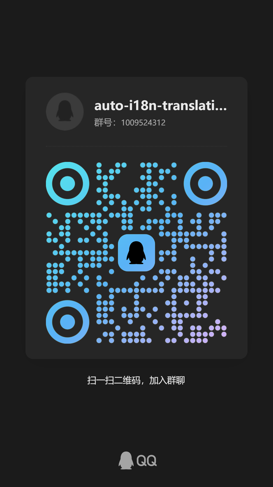

<div align="center">
  
</div>

# 🚀 auto-i18n-translation-plugins

## 🍉 Plugin Introduction

A 🎉 **frontend auto-translation plugin** that supports all JavaScript-based frontend frameworks (like Vue2/3 and React). No source code modification needed! Easily achieve multi-language support with one click 🌐🚀. Comes with Youdao and Google translation services by default, while supporting custom translators. Compatible with major build tools like Webpack, Vite, and Rollup.

### 🎯 Key Features:

-   🛠️ **No source code changes** - Quick multi-language translation with one click
-   🌐 **Supports multiple translation services** (Google, Youdao, and custom translators)
-   🔍 **Smart detection** of text needing translation
-   🔧 **Flexible configuration options** for different project needs

Note: Youdao translation requires users to apply for their translation service - the demo keys have been exhausted.

---

## 📚 Plugin Debugging

```bash
pnpm install
pnpm run build
pnpm run preview // Don't select React, contains too much English text
```

---

## 📖 Supported Features

-   **Frameworks**: All JavaScript-based frontend frameworks (Vue2/3, React, etc.)
-   **Build Tools**: Fully compatible with Webpack, Vite, Rsbuild and Rollup 🚀
-   **Translation Services**: Default support for **Youdao** and **Google** translation, plus custom translators

---

## ❓ Common Issues

[Documentation](https://juejin.cn/post/7483435518526062626).

---

## 🌟 Quick Start 🚀

### 1️⃣ Install Plugin 📦

#### **🌐 Vite Project:**

```bash
npm install vite-auto-i18n-plugin --save-dev
# or
yarn add vite-auto-i18n-plugin --dev
```

#### **🛠️ Webpack Project (Compatible with Webpack 4/5):**

```bash
npm install webpack-auto-i18n-plugin --save-dev
# or
yarn add webpack-auto-i18n-plugin --dev
```

#### **⚡ Rsbuild Project:**

```bash
npm install rsbuild-auto-i18n-plugin --save-dev
# 或
yarn add rsbuild-auto-i18n-plugin --dev
```

---

### 2️⃣ Language Switching 🌐

#### ⚙️ Basic Switching

```js
window.localStorage.setItem('lang', value)
window.location.reload()

// value is the key of the language mapping object
// The mapping object is located in the lang/index.js file by default. You can check this part of the code inside.
const langMap = {
  'en': (),
  'zhcn': ()
}
```

#### 📲 Instant Language Switching

If you don't want to switch languages by refreshing the page, you can directly modify the language via `$changeLang` and then re - render the corresponding components.

```js
window.$changeLang('en')
```

For example, in Vue2, you can switch languages without refreshing the page in the following way:

```Html
<template>
    <div id="app" v-if="isShow">
        <button @click="changeLang('en')">Switch to English</button>
        <button @click="changeLang('zh-cn')">Switch to Chinese</button>
        <router-view></router-view>
    </div>
</template>
<script>
export default {
    data() {
        return {
            isShow: true
        }
    },
    methods: {
        changeLang(lang) {
            window.$changeLang(lang)
            this.isShow = false
            this.$nextTick(() => {
                this.isShow = true
            })
        }
    }
}
</script>
```

#### 🔄 Replace Language Packs

If you want to modify the built - in generated language packs, you can directly modify the `langMap` in the global object. For example:

```js
window.langMap = {
    en: {
        zccsau6: 'hello'
    },
    'zh-cn': {
        zccsau6: '你好'
    }
}
```

Then you can refresh the page by using the above **Instant Language Switching** method.

---

### 3️⃣ Basic Configuration 🔧

#### **Vite Configuration Example** (vite.config.js):

```javascript
import vitePluginsAutoI18n, { YoudaoTranslator } from 'vite-auto-i18n-plugin'
import vue from '@vitejs/plugin-vue'
import { defineConfig } from 'vite'

export default defineConfig({
    plugins: [
        vue({
            template: {
                compilerOptions: {
                    hoistStatic: false,
                    cacheHandlers: false
                }
            }
        }),
        vitePluginsAutoI18n({
            translator: new YoudaoTranslator({
                appId: '4cdb9baea8066fef',
                appKey: 'ONI6AerZnGRyDqr3w7UM730mPuF8mB3j'
            })
        })
    ]
})
```

#### **Webpack Configuration Example** (webpack.config.js):

```javascript
const webpackPluginsAutoI18n = require('webpack-auto-i18n-plugin')
const { YoudaoTranslator } = require('webpack-auto-i18n-plugin')

const i18nPlugin = new webpackPluginsAutoI18n.default({
    translator: new YoudaoTranslator({
        appId: '4cdb9baea8066fef',
        appKey: 'ONI6AerZnGRyDqr3w7UM730mPuF8mB3j'
    })
})

module.exports = {
    plugins: [
        new VueLoaderPlugin(),
        new HtmlWebpackPlugin({
            template: './public/index.html'
        }),
        i18nPlugin
    ]
}
```

#### **Rsbuild Configuration Example** (rsbuild.config.js):

````javascript
const rsbuildPluginsAutoI18n = require('rsbuild-auto-i18n-plugin')
const { YoudaoTranslator } = require('rsbuild-auto-i18n-plugin')

export default defineConfig({
  plugins: [
    pluginReact(),
    rsbuildPluginsAutoI18n({
      targetLangList: ['en'],
      translator: new YoudaoTranslator({
            appId: '4cdb9baea8066fef',
            appKey: 'ONI6AerZnGRyDqr3w7UM730mPuF8mB3j'
        })
    })
  ],
});

---

### 4️⃣ Translator Configuration Examples 🛠️

The plugin uses Google Translate by default (with a default proxy port of 7890). When the network does not support accessing Google, we recommend using **Youdao Translate** ✨, which has excellent translation quality. Currently, the plugin has built - in support for Google, Youdao, and Baidu translation services. If you need to customize a translator, you can refer to the examples below.

The following examples use `vite` as an example, and `webpack`、`rsbuild` is similar.

#### **Using Google Translate (Default)**

```javascript
import { GoogleTranslator } from 'vite-auto-i18n-plugin'

...
translator: new GoogleTranslator({
    proxyOption: {
        host: '127.0.0.1',
        port: 7890,
        headers: {
            'User-Agent': 'Node'
        }
    }
})
...
````

#### **Using Youdao Translation**

You need to apply for an API. [API documentation](https://ai.youdao.com/DOCSIRMA/html/trans/api/wbfy/index.html).

```javascript
import { YoudaoTranslator } from 'vite-auto-i18n-plugin'

...
translator: new YoudaoTranslator({
    appId: 'The appId you applied for',
    appKey: 'The appKey you applied for'
})
...
```

#### **Baidu Translator**

You need to apply for an API. [API documentation](https://api.fanyi.baidu.com/product/113).

```javascript
import { BaiduTranslator } from 'vite-auto-i18n-plugin'

...
translator: new BaiduTranslator({
    appId: 'The appId you applied for', // Baidu Translate AppId
    appKey: 'The appKey you applied for' // Baidu Translate AppKey
})
...
```

#### **Volcengine AI Translator**

It supports translation using `doubao` or `deepseek`. The translation effect of large AI models is more accurate than traditional API translation, but it takes longer.
Introduction to Volcengine large models: https://www.volcengine.com/docs/82379/1099455.
You need to activate the large model service and apply for an API. [API documentation](https://www.volcengine.com/docs/82379/1298454).

```javascript
import { VolcengineTranslator } from 'vite-auto-i18n-plugin'

...
translator: new VolcengineTranslator({
    apiKey: 'The apiKey you applied for',
    model: 'The model you want to call, for example: `doubao-1-5-pro-32k-250115`. Please ensure that the corresponding model has been activated in the console before use.'
})
...
```

#### **Empty Translator**

If you only need to scan the target language without performing translation, this translator will generate a JSON file.

```javascript
import { EmptyTranslator } from 'vite-auto-i18n-plugin'

...
translator: new EmptyTranslator()
...
```

#### **Custom Translator**

If you have a personal translation API, you can customize a translator in the following ways:

The simplest way is to define a translator instance using the `Translator` base class.

```javascript
import { Translator } from 'vite-auto-i18n-plugin'
import axios from 'axios'

...
translator: new Translator({
    name: 'My Translator',
    // Translation method
    fetchMethod: (str, fromKey, toKey, _separator) => {
        // The actual API call may be more complex than the example. For details, please refer to the implementation of YoudaoTranslator in the source code. Path: packages\autoI18nPluginCore\src\translators\youdao.ts
        const myApi = 'https://www.my-i18n.cn/api/translate?from=${fromKey}&to=${toKey}&t={+new Date}'
        return axios.post(myApi, { str })
            .then(res => res.data)
    },
    // Interface trigger interval. Some interfaces may be blocked if triggered frequently. Please set a reasonable interface trigger interval according to the actual situation.
    interval: 1000
})
...
```

If you need more advanced features, you can use inheritance. However, there is currently no relevant scenario.

```javascript
import { Translator } from 'vite-auto-i18n-plugin'

class CustomTranslator extends Translator {
    constructor () {
        super({
            name: 'My Translator',
            ...
        })
    }
}

...
translator: new CustomTranslator()
...
```

---

### 5️⃣ Project Entry Configuration 🏗️

Please import the language configuration file at the top of the **project entry file** (e.g., `main.js`):

```javascript
import '../lang/index.js' // 📍 Must be imported on the first line of the entry file. The file will be automatically generated when the plugin is run. By default, it is located in the 'lang' folder at the same level as the packaging configuration directory. The 'index.js' inside is the configuration file.
```

**Generated File Description:**

The generated `lang/index.js` file contains the following global functions and objects:

- `window.$t(key, defaultValue, namespace)` - Translation function
- `window.$$t(value)` - Simple translation function (returns original value)
- `window.$deepScan(value)` - Deep scan marker function (only effective when `deepScan: true`)
- `window.$iS(template, args)` - Interpolation string function (supports `${0}` or `\${0}` format placeholders)
- `window.$changeLang(lang)` - Language switching function
- `window.langMap` - Language mapping object

**Compatibility Guarantee:**

Starting from v1.1.17, all global functions and objects are mounted through an intelligent fallback mechanism, fully compatible with legacy browsers (including IE 11).

---

## ⚙️ Configuration Parameters

| Parameter            | Type       | Required | Default                  | Description                                                                                                                  |
| -------------------- | ---------- | -------- | ------------------------ | ---------------------------------------------------------------------------------------------------------------------------- |
| enabled              | boolean    | ❌       | `true`                   | Whether to trigger translation.                                                                                              |
| translateType        | string     | ❌       | `full-auto`              | Translation mode: `full-auto` or `semi-auto`                                                                                 |
| translateKey         | string     | ✅       | `$t`                     | Translation function name (e.g., `$t`)                                                                                       |
| excludedCall         | string[]   | ❌       | `['$i8n', 'require', …]` | Function calls to exclude from translation                                                                                   |
| excludedPattern      | RegExp[]   | ❌       | `[/\.\w+$/]`             | Patterns to exclude (e.g., file extensions)                                                                                  |
| excludedPath         | string[]   | ❌       | `['node_modules']`       | Directories to exclude (e.g., `node_modules`)                                                                                |
| includePath          | RegExp[]   | ❌       | `[/src\//]`              | Whitelist of directories to include (default: `src`)                                                                         |
| globalPath           | string     | ❌       | `'./lang'`               | Path for translation config files                                                                                            |
| distPath             | string     | ✅       | `''`                     | Output path for built files                                                                                                  |
| distKey              | string     | ✅       | `'index'`                | Main translation file name                                                                                                   |
| namespace            | string     | ✅       | `lang`                   | Project namespace for distinguishing translation configs                                                                     |
| originLang           | string     | ✅       | `'zh-cn'`                | Source language                                                                                                              |
| targetLangList       | string[]   | ✅       | `['en']`                 | Target languages                                                                                                             |
| buildToDist          | boolean    | ❌       | `false`                  | Whether to bundle translation files into main build                                                                          |
| translator           | Translator | ❌       | `GoogleTranslator`       | Translator instance                                                                                                          |
| translatorOption     | object     | ❌       | `{}`                     | Translator options (lower priority than `translator`)                                                                        |
| rewriteConfig        | boolean    | ❌       | `true`                   | Whether to rewrite config file on each plugin run                                                                            |
| deepScan             | boolean    | ❌       | `false`                  | Experimental: Whether to perform deep string scanning                                                                        |
| commonTranslateKey   | string     | ❌       | `''`                     | Common translation key for sharing language settings across multiple projects with different namespaces. When set, language switching will prioritize reading the language from localStorage using commonTranslateKey, enabling unified language management across projects |
| insertFileExtensions | string[]   | ❌       | `[]`                     | List of file extensions to insert translation code into                                                                      |
| isClear              | boolean    | ❌       | `false`                  | Whether to clear content not in context (clear source language key-value pairs not in context), only supported in build mode |
| isClearSpace         | boolean    | ❌       | `false`                  | Whether to remove whitespace from both ends of source strings, whitespace is preserved by default                            |
| languageJsonMode     | string     | ❌       | `'merged'`               | Language JSON storage mode: `'merged'` (all languages in one index.json) or `'split'` (separate json file for each language) |

---

## 🔍 What does `deepScan` do?

`deepScan` is an experimental property controlling whether the plugin performs deep string scanning.

By default, the plugin scans strings/template strings - if any target language text is found, the entire string is included:

```js
;`<div>
    <p>你好</p>
</div>`
```

Since there's Chinese text, the whole string would be included, potentially causing inaccurate translation. With `deepScan` enabled, the plugin splits and reconstructs template strings, only translating matching text:

```js
;`<div>
    <p>${$t('你好')}</p>
</div>`
```

Now only '你好' gets translated, not the entire string.

### 🔥 Using the $deepScan Function

When `deepScan: true` is enabled, the plugin automatically generates a `$deepScan` global function. This function marks template strings that need deep scanning:

```js
// Wrap template strings with $deepScan
const template = $deepScan(`
    <div class="container">
        <h1>Welcome</h1>
        <p>This is a test</p>
    </div>
`)

// The plugin automatically converts it to:
const template = `
    <div class="container">
        <h1>${$t('Welcome')}</h1>
        <p>${$t('This is a test')}</p>
    </div>
`
```

**Notes:**
- `$deepScan` only returns the original value at runtime without any processing
- Primarily used to tell the plugin at compile time that this string needs deep scanning
- Only takes effect when `deepScan: true` is configured

---

## 🌐 Global Object Compatibility

Starting from v1.1.17, the generated translation config file (`lang/index.js`) is fully compatible with legacy browsers, including IE 11.

### Compatibility Mechanism

The plugin uses the following fallback priority to obtain the global object:

1. `globalThis` - Modern browsers (ES2020+)
2. `window` - Browser environment (IE 11+ compatible)
3. `global` - Node.js environment
4. `self` - Web Workers environment

### Supported Browser Versions

- ✅ Chrome 49+
- ✅ Firefox 52+
- ✅ Safari 10+
- ✅ Edge 12+
- ✅ IE 11
- ✅ All modern browsers

**No additional configuration needed** - the generated files automatically handle compatibility.

---

## 👋 `translateType` Functionality

Added in v1.0.11, with two options:

`full-auto`: Fully automatic translation (default supports Chinese, Japanese, Korean, Russian)

`semi-auto`: Semi-automatic translation (supports all source languages)

In `semi-auto` mode, users must wrap target text with `translateKey` (e.g., `$t('hello')`), which the plugin will then translate.

Example:

```js
const HelloWorld: React.FC<HelloWorldProps> = ({ name = 'World' }) => {
    return (
        <div className="hello-world">
            <h1>
                {$t('Hello,')} {name}!
            </h1>
            <p>{$t('Welcome to our application')}</p>
        </div>
    )
}
```

---

## ❓ Why `buildToDist`?

In Vite, the plugin only generates translation config files. Without `buildToDist`, these files won't be bundled. ⚠️ Enabling this bundles them but may create duplicate config files.

---

## 🔄 How to Update Translations?

After running the plugin, two files are generated in `\lang`:

-   **index.js**: Translation function logic
-   **index.json**: Translation content

To update translations, simply modify `index.json`.

---

## ⚠️ Usage Notes

1. **Proxy Requirements**

    - In China, **Youdao Translate** is strongly recommended
    - Google Translate requires proxy configuration
    - Default proxy port: **7890** (customizable via `proxyOption`)

2. **Translation Frequency**

    - Google Translate is free but may limit frequent requests 🔒
    - Set reasonable intervals between requests 💡

3. **Translation Updates**
    - `index.json` in `globalPath` is the core translation file
    - Changes take effect immediately after saving

4. **JSON Storage Mode Switching** ⚠️

    - When switching `languageJsonMode` config (`merged` ↔ `split`), it's **strongly recommended** to set `rewriteConfig` to `true`.
    - This ensures the plugin regenerates config files and avoids errors caused by conflicts between old and new mode files.
    - After switching modes, the plugin will automatically handle JSON file merging or splitting.

---

## 📦 User Group

QQ Group



---

## 📦 Example Project

Example project: [example](./example) (click to view)

## 📜 License

MIT License 🪪 - Free to use and contribute!

May this plugin make your i18n development easier and more efficient! 🌍✨

---

## ✨ Update

Since v1.0.5, simply import the generated `index.js` in your entry file - no need to manually create language switching functions. 👏

---

## 🎆 Authors

Original authors: wenps, xu-code, Caleb-Xu, Winfans

## Changelog

### v1.1.17 (Latest Version)

-   **Enhanced Global Object Compatibility**: Generated translation config files now support legacy browsers (IE 11+) through a fallback mechanism: `globalThis` → `window` → `global` → `self`
-   **Optimized deepScan Feature**: Added `$deepScan` global function for marking template string parts that need deep scanning, improving translation accuracy
-   **Improved Code Structure**: Optimized translation function generation logic, all code wrapped in IIFE to prevent global scope pollution

### v1.1.16 (Recommended Version)

-   Fixed issue where double quotes in template strings caused abnormal ID mapping generation

### v1.1.15 (Recommended Version)

-   Added Node 14 compatibility

### v1.1.14 (Recommended Version)

-   Fixed rewriteConfig exception issue

### v1.1.13 (Not Recommended Version)

-   Added JSON split configuration

### v1.1.12 (Recommended Version)

-   Optimized console output format

### v1.1.11 (Recommended Version)

-   Optimized console output format, reduced redundant printing
-   Added translation progress bar display
-   Support for Webpack 4

### v1.1.10 (Recommended Version)

-   Added rsbuild plugin

### v1.1.9 (Recommended Version)

-   Fixed issue where deepScan string splitting wasn't handling line breaks and other special characters

### v1.1.8 (Recommended Version)

-   Renamed configuration for controlling leading/trailing whitespace removal

### v1.1.7 (Recommended Version)

-   Added compatibility for enable feature and translation initialization completion
-   Added configuration option to control whether to remove leading/trailing whitespace during scanning
-   Fixed issue with abnormal triggering of new translations
-   Fixed issue where cleanup configuration was not taking effect

### v1.1.6 (Recommended Version)

-   Fixed issue where clearing whitespace before/after template strings caused mismatch between JSON and translation functions
-   Fixed issue where Chinese brackets in interpolation caused interpolation to fail
-   Added configuration cleanup functionality

### v1.1.5 (Recommended Version)

-   Added support for interpolation translation

### v1.1.4 (Recommended Version)

-   Fixed template string processing exception in exclude functions
-   Added interval configuration for Google Translate
-   Added support for custom interface parameters in translators

### v1.1.3 (Recommended Version)

-   Added the ability to update languages without refreshing and best practices

### v1.1.2

-   Fixed AI translation exceptions

### v1.1.1

-   New translation disable function

### v1.1.0

-   New AI translator
-   New Vue2 extension plugin mechanism for translation plugins

### v1.0.26 (Recommended Version)

-   Added custom extension arrays

### v1.0.25 (Recommended Version)

-   Added a universal translation key

### v1.0.24 (Recommended Version)

-   Fixed the exception issue in semi-automatic mode

### v1.0.23 (Recommended Version)

-   Fixed a major bug in packaging and writing.

### v1.0.22

-   Added scan translator

### v1.0.21

-   Added deep scanning

### v1.0.20

-   Fixed filter function issues and added config overwrite option

### v1.0.19

-   Backward compatibility for config files

### v1.0.18

-   Fixed optional chaining issues in older Node versions

### v1.0.17

-   Basic SSR support (experimental)

### v1.0.16

-   Fixed Vue3 comment node issues

### v1.0.15

-   Added Baidu Translate

### v1.0.14

-   Fixed new language type segmentation
-   Added Japanese, Korean, Russian support

### v1.0.13

-   Bug fixes

### v1.0.12

-   Type optimizations

### v1.0.11

-   Bug fixes
-   Added `translateType` option for semi-auto mode

```js
// Users can wrap text with translateKey
// e.g., $t('hello') - plugin will scan and translate these
$t('hello')
```
